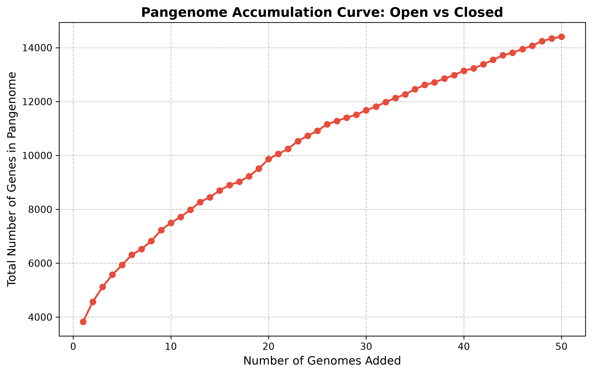
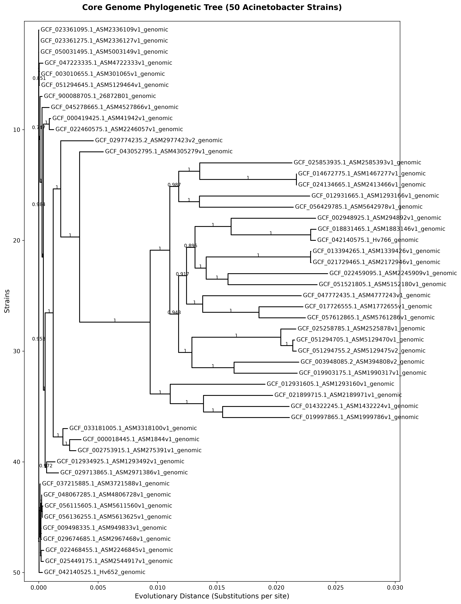
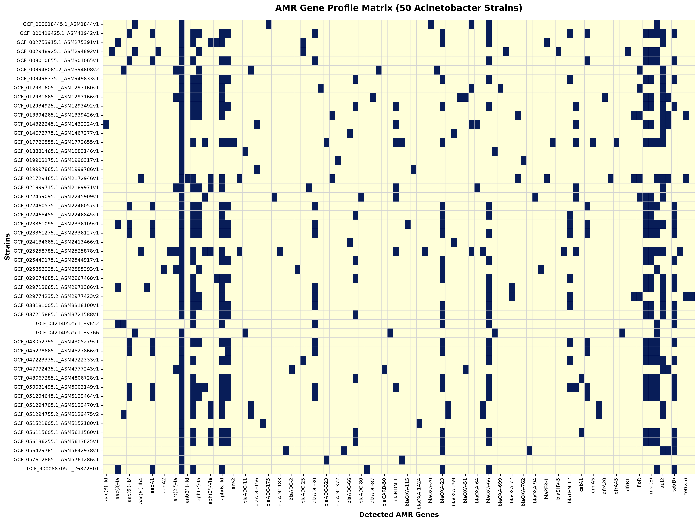

# 🧬 Comparative Pangenomics & AMR Gene Profiling of 50 *Acinetobacter* Genomes


An end-to-end bioinformatics pipeline analyzing **50 *Acinetobacter* genomes** to explore their pangenome structure, core genome evolutionary relationships, and antimicrobial resistance (AMR) gene profiles.

---

## 📌 Executive Summary

* **Open Pangenome Dynamics**: The accumulation curve displays a continuous, non-saturating trajectory across 50 strains, reaching over **14,000 total gene clusters**, confirming an **open pan-genome** driven by active horizontal gene acquisition.
* **Core Genome Conservation**: Identified **2,189 core genes** shared across all strains, serving as the foundation for high-resolution phylogenetic reconstruction.
* **AMR Gene Burden**: Comprehensive screening revealed widespread aminoglycoside resistance (`ant(2'')-Ia`), critical carbapenemases (`blaOXA-23`, `blaOXA-66`, `blaNDM-1`), and co-occurring multidrug resistance (MDR) blocks (`sul2`, `tet(B)`, `msr(E)`).

---

## 📊 Key Results & Visualizations

### 1. Pangenome Accumulation Curve (Open vs. Closed)
The accumulation plot confirms the open nature of the *Acinetobacter* pan-genome, highlighting continuous genetic diversification as new genomes are added.



---

### 2. Core Genome Phylogenetic Tree
A Maximum Likelihood phylogenetic tree constructed with **FastTree** ($GTR+CAT$ model) on the 2,189 core gene alignments, resolving distinct clonal and divergent lineages.



---

### 3. AMR Resistance Profile Heatmap
A binary presence/absence matrix generated using **ABRicate** (NCBI database), illustrating the distribution of key resistance markers across all 50 strains.



---

## 🗂️ Project Workflow & Repository Structure

```text
pangenomic_project/
├── 01_Data_Acquisition.ipynb      # Genome retrieval & NCBI assembly data checks
├── 02_Genome_Annotation.ipynb     # Automated annotation with Prokka (.gff generation)
├── 03_Pangenome_Analysis.ipynb    # Roary pipeline & Open vs Closed accumulation curve
├── 04_Phylogenetic_Analysis.ipynb # FastTree ML tree construction & Biopython plotting
├── 05_AMR_Gene_Profiling.ipynb    # ABRicate screening & Seaborn AMR Heatmap matrix
├── my_genomes/                    # Raw FASTA genome files (.fna)
├── gff_files/                     # Prokka output GFF files
├── roary_output/                  # Pangenome alignments & statistics
├── pangenome_curve.png            # Saved Pangenome plot
├── core_tree.png                  # Saved Phylogenetic Tree plot
├── amr_heatmap.png                # Saved AMR Heatmap plot
└── README.md                      # Project documentation